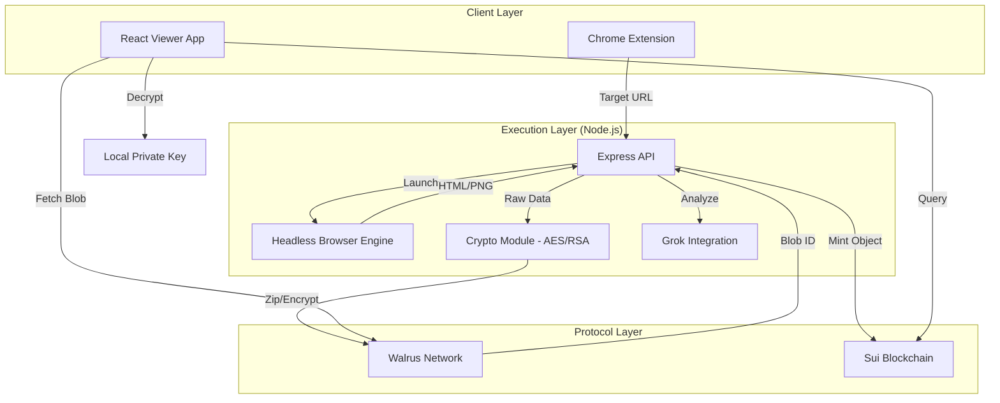

# 🏗️ System Architecture

ArchiveChain is a decentralized application (dApp) built on a modular architecture separating **Capture**, **Storage**, **Provenance**, and **Analysis**.

---

## 🧩 Component Diagram



---

## 1️⃣ The Execution Layer (Backend)

**Runtime:** Node.js (TypeScript)  
**Role:** The trusted oracle/witness

### Key Modules

#### Capture Engine
- Uses `puppeteer` to render full DOM and take screenshots
- Configured with stealth settings to avoid bot detection

#### Compression
- Uses `jszip` (Level 6 compression) to bundle assets

#### Uploader
- Implements a **"Resilient Uploader"** that iterates through multiple Walrus Publisher nodes (stakely, nodes.guru, official) to ensure high availability

#### Sui Client
- Manages the Ed25519 keypair to sign transactions and interact with the Move contract

---

## 2️⃣ The Protocol Layer (Blockchain & Storage)

### A. Sui (The Registry)

**Network:** Sui Testnet  
**Package ID:** `0xe7fc68dde0e6cd9617328a8fc011cc16668807b4b9a950d22ec67653774234de`

#### Data Model

**URLRegistry:** A shared object that maps a URL string to a vector of Archive IDs.

**Archive:** An immutable struct containing:

```rust
struct Archive has key, store {
    id: UID,
    url: String,
    walrus_blob_id: String,      // Link to content
    content_hash: vector<u8>,    // SHA-256 Integrity check
    captured_at_ms: u64,         // Trustless timestamp
    version_number: u64
}
```

### B. Walrus (The Vault)

**Role:** Decentralized Blob Storage

**Data Stored:** `.zip` archives containing `index.html` and `screenshot.png`

#### Access Pattern

| Operation | Method | Endpoint |
|-----------|--------|----------|
| **Write** | Direct HTTP PUT | Publisher Nodes |
| **Read** | Direct HTTP GET | Aggregator Nodes (using blobId from Sui) |

---

## 3️⃣ The Privacy Layer (Encryption)

We use a **Hybrid Cryptosystem** to enable the "Whistleblower Drop."

### Cryptographic Specifications

- **Key Exchange:** RSA-OAEP (2048-bit)
- **Content Encryption:** AES-256-GCM

### Encryption Process

1. **AES:** A fresh, random 256-bit AES key is generated for every archive
2. **Encrypt Content:** The zip file is encrypted with this AES key
3. **Encrypt Key:** The AES key itself is encrypted using the recipient's RSA Public Key
4. **Packaging:** The payload is structured as a binary buffer:

```
[IV (16b)] + [AuthTag (16b)] + [KeyLength (2b)] + [Encrypted AES Key] + [Encrypted Content]
```

---

## 4️⃣ The Intelligence Layer (AI)

**Model:** Grok Beta (via xAI API)  
**Function:** Semantic Difference Analysis

### Analysis Pipeline

| Step | Description |
|------|-------------|
| **Input** | Text_Version_A vs Text_Version_B |
| **Prompt Engineering** | The AI is instructed to act as a "Forensic Analyst" |
| **Output** | Categorizes changes into "Censorship," "Correction," or "Update" based on semantic tone and factual removal |

---

## 5️⃣ Trust Assumptions

| Layer | Trust Model | Future Roadmap |
|-------|-------------|----------------|
| **Capture** | Users trust the Backend Node to capture the URL honestly | Verify using Nautilus TEEs |
| **Storage** | We trust Walrus availability | Erasure coding provides guarantees |
| **Timestamp** | We trust the Sui Validator set for accurate timestamps | — |
| **Privacy** | We trust standard crypto primitives (AES/RSA) | Backend never stores private keys |

---

## 🔗 System Integration Flow

### Write Path (Archiving)

```
Extension → Backend API → Puppeteer Capture → Compression → Encryption (Optional)
    → Walrus Upload → Sui Transaction → Immutable Archive Object
```

### Read Path (Verification)

```
Viewer → Sui Query (Get Archive Metadata) → Walrus Fetch (Get Content)
    → Local Decryption (If Encrypted) → Display + Integrity Check
```

### Analysis Path (Comparison)

```
Viewer → Fetch Version A & B from Walrus → Strip Non-Visible Code
    → Generate Diff → Grok AI Analysis → Display Semantic Assessment
```

---

## 📊 Technology Stack Summary

| Layer | Technology | Purpose |
|-------|-----------|---------|
| **Frontend** | Chrome Extension, React | User interface and interaction |
| **Backend** | Node.js, TypeScript, Express | Execution and orchestration |
| **Capture** | Puppeteer | Headless browser automation |
| **Compression** | jszip (Level 6) | Asset bundling |
| **Storage** | Walrus Network | Decentralized blob storage |
| **Blockchain** | Sui (Move) | Immutable provenance registry |
| **Encryption** | RSA-OAEP, AES-256-GCM | Privacy protection |
| **Hashing** | SHA-256 | Content integrity verification |
| **AI** | Grok Beta (xAI) | Semantic analysis |

---

## 🛡️ Security Properties

### Tamper Resistance
- Content hash verification ensures byte-level integrity
- Immutable blockchain objects prevent post-hoc modification

### Decentralization
- No single point of failure or censorship
- Erasure coding distributes data across multiple nodes

### Privacy
- End-to-end encryption for whistleblower mode
- Keys never leave client or recipient devices

### Transparency
- Open verification of all archives via blockchain
- Publicly auditable timestamps and content hashes
